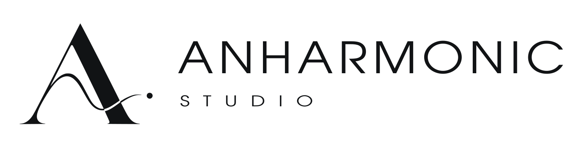

# Anharmonic Studio

<picture>
  <source media="(prefers-color-scheme: dark)" srcset="assets/branding/logo-pack/01-Logos/anharmonic-horizontal-white.svg">
  
</picture>

A native desktop music studio for sampling, beatmaking, synthesis, arranging,
vocal production, and mixing. Import a sound, cut it into playable slices,
build a rhythm, write notes, arrange a song, and export a stereo WAV.

[Explore the studio and watch the film](https://anharmoniclabs.github.io/AnharmonicStudio/)

## Get Anharmonic Studio

Official **Linux, Windows, Intel Mac, and Apple Silicon Mac downloads** fund development.
Official released binaries are the supported distribution for musicians: download,
install, and open the studio. They bundle the runtime and dependencies, with no compiler
setup or subscription requirement to keep using your installed version.

The current packages are **unsigned 0.1.0-rc.1 release candidates**. Signing,
notarization, and physical audio-interface acceptance remain unfinished.
The standard download costs $1 USD once, plus applicable tax, through Stripe checkout.
After payment confirmation, your selected installer downloads from private Cloudflare storage.

| Option | Price (USD) | Includes |
| --- | --- | --- |
| Source code | **Free** | Full source; build it yourself without an account or purchase |
| Official download | **$1**, one time | Current major version and its updates, on all supported platforms |
| Supporter download (planned) | **$45 or more**, one time | Current and next major version and their updates |
| Optional donation on Ko-fi | **Any amount** | Development support only; no download entitlement |

The standard $1 download and separate Ko-fi donations are open. See [downloads and pricing on the
website](https://anharmoniclabs.github.io/AnharmonicStudio/#download) and the
[distribution plan](DISTRIBUTION.md). Paid installers stay outside this public repository
and Pages site. Source access stays free; recipients retain their GPL rights.
The [matching source and license packages for all four platforms](https://github.com/Anharmoniclabs/AnharmonicStudio/releases/tag/v0.1.0-rc.1-source)
are public GitHub release assets. Cloudflare R2 stores only the compiled installers.

## What is inside

- **Sampler:** import audio, trim ranges, detect transients, and map slices to four 4×4 pad banks.
- **Beats:** program step patterns and control per-hit velocity.
- **Instruments:** explore factory sounds, shape analog synth patches, and record arpeggiator notes.
- **Notes:** write synth parts or play samples chromatically in the piano roll.
- **Song:** arrange patterns and audio clips, create variations, and automate levels and pan.
- **Mix:** balance tracks with EQ, saturation, compression, delay, and reverb.
- **Vocals:** record directly into Song, open recorded clips in Autotune, build comps, and render pitch correction to a new take.
- **Export:** render the arrangement to a 48 kHz stereo WAV.
- **Devices:** automatically connect MIDI inputs, remember controller mappings, and load external VST3 instruments and effects.

The optional stem-separation engine requires extra dependencies and an initial
model download. The core studio works locally after installation.

## MIDI controllers and plugins

Open **Tools → Devices & Plugins**. MIDI inputs are checked every second and
reconnected automatically. Choose **Keys**, **Pads**, or the combined mode
(keys plus pads on MIDI channel 10). Use **MIDI Learn** to assign unfamiliar
pad layouts, transport buttons, knobs, and faders. Mappings are remembered;
unplugging a controller releases its held notes. MPK/MPC compatibility depends
on the device exposing a standard MIDI input; proprietary modes may require
the manufacturer's driver or a MIDI/controller-mode setting.

The plugin scanner checks standard installation folders and folders you add.
Load one VST3 instrument for synth notes and one master effect. Parameters and
presets save with the project and are used during WAV export. Pitch bend and
unmapped MIDI CCs reach the external instrument during live playing. Native
plugin windows, MIDI output/clock synchronization, and recording expression
automation are not implemented yet. Plugin controls use the studio's parameter
panel; applying changes reloads that plugin.

Plugins must match your operating system and processor. VST2, CLAP, and LV2
are listed but cannot be loaded by this host. Audio Unit support is available
through the host on macOS; this integration has only been tested on Linux.
Linux checks include the Nekobi instrument and MVerb effect; other plugins may
need different bus layouts or host features. Each plugin runs in a separate
process. A failed instrument is silenced and a failed effect is bypassed;
failed exports report the error. Live monitoring adds two audio buffers per
loaded plugin (about 21 ms each at 48 kHz / 512 frames).

The Audio interfaces tab refreshes available outputs, including Linux PipeWire
devices. Choose the desired routing in Audio setup; connecting hardware does
not automatically change your recording input or output.

## Free source for developers

The full application source is free under **GPL-2.0-or-later**, including the scripts
used to compile and install it. No purchase is required to study, build, modify, or
share it under that license.

Source builds are intended for developers who maintain their own toolchain,
dependencies, and audio configuration. **We do not provide installation or configuration
troubleshooting for self-compiled copies.** A source checkout does not include a signed
official installer or managed update channel. Reproducible application bug reports and
patches are welcome.

- [Developer build guide](BUILDING.md): prerequisites, native compilation, validation,
  and packaging for Linux, Windows, Apple Silicon Mac, and Intel Mac.
- [Support scope](SUPPORT.md): official builds and self-compiled copies.
  Purchase and installer help: [anharmoniclabs@gmail.com](mailto:anharmoniclabs@gmail.com).
- [Contributing](CONTRIBUTING.md): development workflow and bug reports.
- [Native packaging](packaging/RELEASE.md): release checks and corresponding source.

Linux developers can continue using `run.sh` after provisioning their environment;
its usage is documented in the developer guide. All build and installation tools
remain in this repository.

## Logo pack

The [complete 84-file logo pack](assets/branding/logo-pack) includes outlined SVGs,
transparent PNGs, light/dark and accent versions, Windows and macOS icons,
favicons, social artwork, and a four-page usage guide.
The desktop uses `assets/branding/anharmonic-studios.svg` for its icon and
`assets/branding/anharmonic-header.svg` for the theme-aware project header.
The pack's [usage notes](assets/branding/logo-pack/README.txt) cover its formats.

## Repository contents

- `mpclab/`: application and audio engine source.
- `native/`: C++ engine source and build configuration.
- `assets/`: application artwork and licensed factory instrument recordings.
- `scripts/`: build, installation, and validation tools.
- `tests/`: automated tests.
- `website/`: the public landing page, pricing, and one-minute commercial.
- `packaging/`: native release instructions and the public encryption certificate.
- [BUILDING.md](BUILDING.md): platform-specific developer build instructions.
- [CONTRIBUTING.md](CONTRIBUTING.md): source development and contribution guide.
- [SUPPORT.md](SUPPORT.md): support scope for official and self-compiled builds.
- [DISTRIBUTION.md](DISTRIBUTION.md): free-source and paid-download model.

Personal libraries, songs, recordings, exports, development docs, agent automation,
credentials, caches, and compiled builds are excluded. This repository starts
with clean source history; it does not import the former development repository's history.

The orchestral recordings are CC0, with their dedication retained alongside the
assets. Other dependencies and media keep their own licenses. See [LICENSE](LICENSE)
and [THIRD_PARTY.md](THIRD_PARTY.md).

## Release candidates

Native 0.1.0-rc.1 candidates passed 227 regression tests per target, frozen-app checks,
and platform packaging checks. The [validated native build run](https://github.com/Anharmoniclabs/AnharmonicStudio/actions/runs/34325465683)
covers Linux, Windows, Intel Mac, and Apple Silicon Mac. Signing/notarization and
physical audio-interface acceptance remain before commercial release.

Release CI uploads encrypted candidates, never plaintext paid installers. See
[the build guide](packaging/RELEASE.md) and [the distribution plan](DISTRIBUTION.md).
